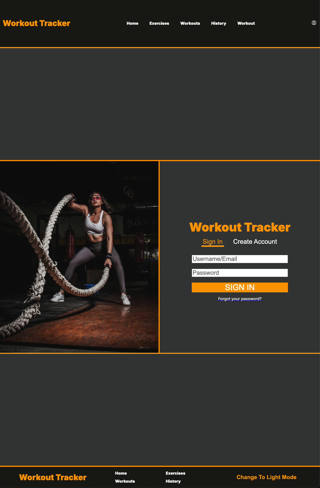
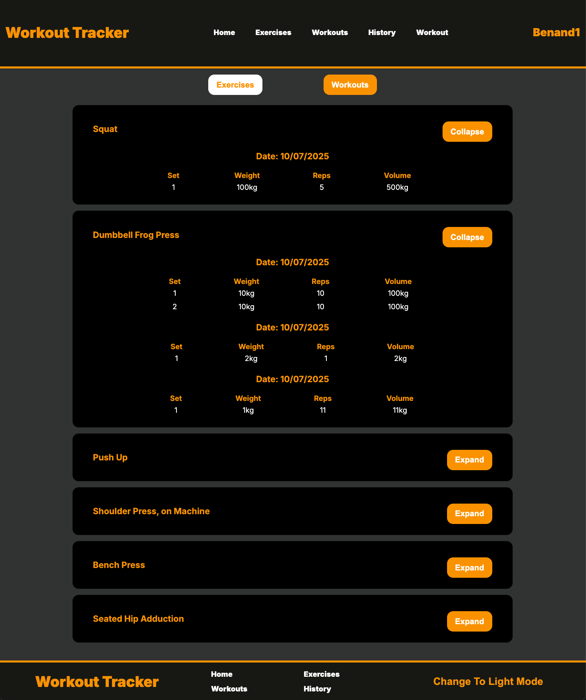
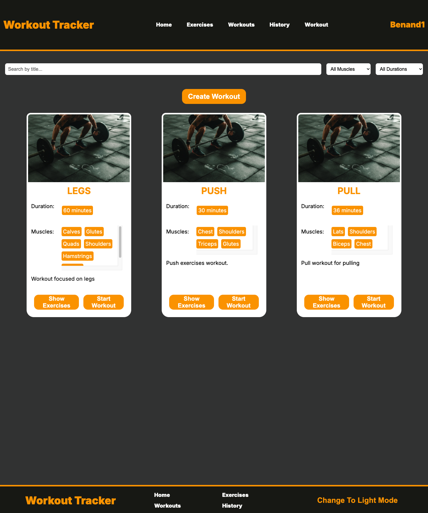
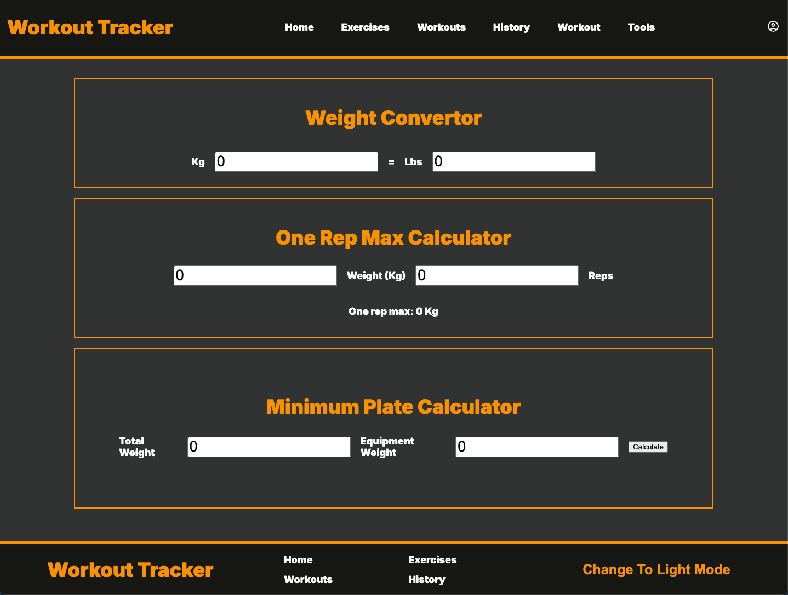

# Getting Started with Create React App

This project was bootstrapped with [Create React App](https://github.com/facebook/create-react-app).

## Prerequisites

* Node.js
* .Net 6 SDK (or later)
* PostgreSQL
* Target Framework: .net 9.0

### Getting Started...

1. Clone the repository:  (CLI) git clone https://github.com/BenAnton/Workout-Tracker-Web-App
2. (CLI) cd Workout-Tracker-Web-App
3. (CLI) cd frontend
4. Install frontend dependencies:  (CLI) npm install
5. (CLI) npm start
6. Open http://localhost:3000 to view it in your browser.
7. (CLI) cd backend
8. (CLI) dotnet run
9. Open http://localhost:5282 to view it in your browser
10. Make sure that PostgreSQL is running and your connection string is configured in appsettings.json
11. (CLI) dotnet ef migration add InitialCreate => dotent ef database update

## Project Overview

A web application for viewing exercises, creating and tracking workouts and monitoring progress and overall statistics.

### Key Technologies:

* React (frontend)
* ASP.NET Core Web API (backend)
* PostgreSQL (relational database)
* Entity Framework Core (ORM)
* JWT authentication (secure login)

### Also Used:

* Reacted Router
* Context API
* CSS
* ASP.NET Identity

### Testing

* Jest for frontend testing
* Xunit for backend testing

## Features

* Authentication: Secure login and signup using JWTs.
* Create Workouts: Design custom workouts from the exercise database.
* Start and complete workouts: Log workout sessions from previously created workouts.
* Workout History: View workout history from previously logged workouts.
* Exercise History: View exercise history from previously logged workouts.
* Dashboard Overview: Summarised view of total workouts, total weight lifted and total reps.
* Responsive UI: Responsive from ultra-wide monitor to standard phone screen.
* Tooling for weight conversion, plate calculations and one rep max calculator.

### Acknowledgments

* Exercises obtained from WGER API
* Project used Create-React-App and .Net Core templates.

### Screenshots

\
\
\
\
\

### Author

Ben Metaxas-Antonaropulos

https://www.linkedin.com/in/ben-anton-13334168/